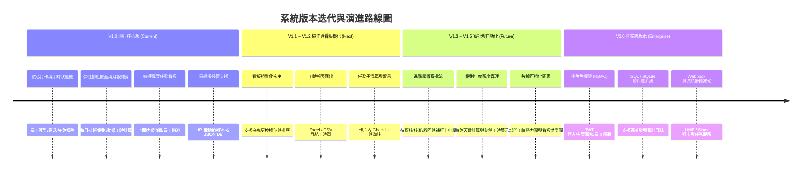

# 01 - 全期產品發展路線圖 (Product Roadmap)

## 1. 產品發展階段藍圖

---

## 2. 各版本里程碑詳細範疇

### 階段一：V1.0 MVP 穩固期（目前版本）
- **達成目標**：全端單一服務器開箱即用、莫蘭迪大地溫暖 UI、核心出勤工時純函式演算法、專案看板基本 CRUD、區網掃碼連線打卡。

### 階段二：V1.1 ~ V1.2 體驗與報表增強（近程計畫）
- **重點任務**：
  1. 整合拖曳套件（如 `@dnd-kit/core` 或 HTML5 原生拖曳），支援看板卡片直覺跨欄拖放。
  2. 財務/人資工時報表一鍵匯出（支援 CSV、Excel 格式，包含員工每日簽到、簽退、扣午休與正負工時結餘）。
  3. 任務卡片新增子項目核取清單（Subtasks / Checklist）與進度百分比條。

### 階段三：V1.3 ~ V1.5 審批機制與假勤深度管理（中程計畫）
- **重點任務**：
  1. 請假流程加入狀態機：`待主管審核 (pending)` $\rightarrow$ `已核准 (approved)` / `已退回 (rejected)`。
  2. 補打卡申請（打卡忘記補簽、公出證明）。
  3. 年度特休假與事病假額度扣減池。

### 階段四：V2.0 企業級多人協作與安全性（長程計畫）
- **重點任務**：
  1. 身分驗證系統（JWT Token + Bcrypt 加密）。
  2. 多角色權限控制（Admin、Manager、Employee）。
  3. 整合第三方通訊軟體（Line Notify / Telegram Bot / Slack）每日打卡與逾期任務提醒。
