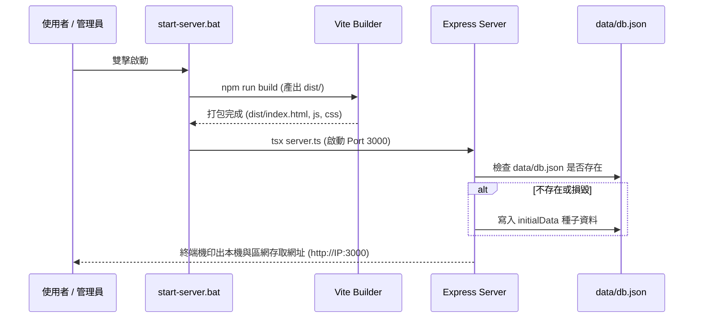

# 01 - 系統全景與架構規格 (System Overview & Architecture)

## 1. 系統定位與目標

本系統為一款現代化全端應用程式，旨在無縫整合 **企業出勤打卡、彈性排班統計、請假審核** 與 **專案任務看板 (Kanban)**，解決傳統打卡軟體與專案管理系統割裂、部署門檻高、缺乏區域網路行動裝置支援等痛點。

---

## 2. 技術棧清單 (Technology Stack)

| 層級 | 技術 / 函式庫 | 版本 | 功用與選型依據 |
| :--- | :--- | :--- | :--- |
| **前端框架** | React | `^19.0.1` | 現代化聲明式 UI、最新 React 19 架構 |
| **程式語言** | TypeScript | `~5.8.2` | 端到端強型別檢查，杜絕執行階段型別錯誤 |
| **建置工具** | Vite | `^6.2.3` | 極速 HMR 熱重載開發環境與輕量生產打包 |
| **樣式引擎** | Tailwind CSS | `^4.1.14` | 現代原子化 CSS、高效能編譯與自訂主題變數 |
| **動畫系統** | Motion (`motion/react`) | `^12.23.24` | 視圖平滑轉場、卡片拖曳與微互動物理效果 |
| **圖示庫** | Lucide React | `^0.546.0` | 一致性高、語義化極簡線性 SVG 圖示 |
| **後端伺服器** | Express | `^4.21.2` | 輕量 RESTful API 路由與 SPA 靜態檔案託管 |
| **執行引擎** | tsx | `^4.21.0` | 開發階段直接執行 TypeScript 後端腳本 |
| **資料儲存** | JSON 本地檔案持久化 | - | `data/db.json` 開箱即用，免安裝重量級關聯式 DB |

---

## 3. 系統拓撲與運作架構

```mermaid
graph TD
    Client[前端 Web SPA (React 19 + Vite)] -->|HTTP RESTful API / JSON| Server[後端 Express 伺服器 (Port 3000)]
    Server -->|SPA Static Files (dist/)| Client
    Server -->|原子化讀寫| DB[(本地持久化 data/db.json)]
    
    subgraph LAN [區域網路環境 (同一 Wi-Fi)]
        PC[開發電腦 (localhost:3000)]
        Phone[行動手機 (http://192.168.x.x:3000)]
        Tablet[平板裝置 (http://192.168.x.x:3000)]
    end
    
    PC --> Client
    Phone --> Client
    Tablet --> Client
```

---

## 4. 區域網路 (LAN) 多裝置連線支援規格

1. **網路介面自動探索**：後端伺服器啟動時，自動呼叫 Node.js `os.networkInterfaces()` 遍歷所有非 Internal 的 IPv4 網卡。
2. **端點提供**：提供 `GET /api/server-info` API，回傳伺服器主機名稱與所有可用的區域網路 IP 清單。
3. **前端展示**：點擊頂部導航列的「區網連線」按鈕即可喚出彈窗，展示所有區網網址並支援一鍵複製與手機瀏覽器快速存取指引。

---

## 5. 部署與啟動生命週期


