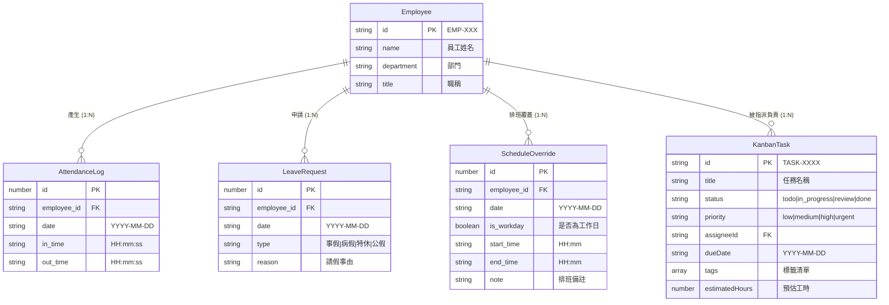

# 02 - 資料模型與資料庫綱要規格 (Data Models & Schema)

## 1. 資料庫儲存架構

系統採用本地 JSON 檔案持久化 (`data/db.json`)，結構如下：

```json
{
  "employees": [],
  "attendanceLogs": [],
  "leaveRequests": [],
  "scheduleOverrides": [],
  "kanbanTasks": []
}
```

---

## 2. 核心實體型別定義 (TypeScript Interfaces)

### 2.1 員工實體 (`Employee`)
儲存公司組織內所有成員之基本檔案。
```typescript
export interface Employee {
  id: string;          // 唯一員工編號，格式 "EMP-XXX" (例如 "EMP-001")
  name: string;        // 員工真實姓名
  department?: string; // 所屬部門 (例如 "研發部", "設計部", "營運部")
  title?: string;      // 職稱 (例如 "資深工程師", "產品設計師")
}
```

### 2.2 打卡紀錄實體 (`AttendanceLog`)
儲存員工每日出勤簽到與簽退之時間戳記。
```typescript
export interface AttendanceLog {
  id: number;              // 唯一識別碼 (通常為 Timestamp，例如 1718000000000)
  employee_id: string;     // 關聯 Employee.id
  date: string;            // 出勤日期，格式 "YYYY-MM-DD"
  in_time: string | null;  // 上班簽到時間，格式 "HH:mm:ss" 或 "HH:mm"
  out_time: string | null; // 下班簽退時間，格式 "HH:mm:ss" 或 "HH:mm"
}
```

### 2.3 請假紀錄實體 (`LeaveRequest`)
儲存員工之請假申請單。
```typescript
export type LeaveType = '事假' | '病假' | '特休' | '公假';

export interface LeaveRequest {
  id: number;          // 唯一識別碼 (Timestamp)
  employee_id: string; // 關聯 Employee.id
  date: string;        // 請假日期，格式 "YYYY-MM-DD"
  type: LeaveType;     // 請假類別
  reason?: string;     // 請假事由說明
}
```

### 2.4 彈性排班覆蓋實體 (`ScheduleOverride`)
用於管理員個別針對特定員工與特定日期調整工作日/排休日或自訂工時。
```typescript
export interface ScheduleOverride {
  id: number;          // 唯一識別碼 (Timestamp)
  employee_id: string; // 關聯 Employee.id
  date: string;        // 覆蓋日期，格式 "YYYY-MM-DD"
  is_workday: boolean; // true: 設定為需出勤工作日, false: 設定為自訂排休
  start_time: string;  // 預計上班時間，格式 "HH:mm" (預設 "09:00")
  end_time: string;    // 預計下班時間，格式 "HH:mm" (預設 "18:00")
  note?: string;       // 排班調整備註說明 (例如 "支援假日值班", "專案補休")
}
```

### 2.5 專案看板任務實體 (`KanbanTask`)
敏捷看板任務項目，可關聯指派同仁。
```typescript
export type TaskStatus = 'todo' | 'in_progress' | 'review' | 'done';
export type TaskPriority = 'low' | 'medium' | 'high' | 'urgent';

export interface KanbanTask {
  id: string;              // 任務編號，格式 "TASK-XXXX"
  title: string;           // 任務標題
  description?: string;    // 任務詳細內容說明
  status: TaskStatus;      // 當前狀態 (todo / in_progress / review / done)
  priority: TaskPriority;  // 優先級 (low / medium / high / urgent)
  assigneeId?: string;     // 指派之員工 ID (關聯 Employee.id，可為空)
  dueDate?: string;        // 預計到期日，格式 "YYYY-MM-DD"
  tags?: string[];         // 分類標籤陣列 (例如 ["Frontend", "UI"])
  estimatedHours?: number; // 預估工時 (小時)
  createdAt: string;       // 建立時間 (ISO 8601 String)
  updatedAt: string;       // 最後更新時間 (ISO 8601 String)
}
```

---

## 3. 實體關聯圖 (ER Diagram)



---

## 4. 級聯刪除規範 (Cascade Cleanup Rules)

當管理員自系統中刪除特定員工 (`DELETE /api/employees/:id`) 時，後端將**自動執行級聯清理**：
1. 刪除該員工之所有打卡紀錄 (`attendanceLogs`)。
2. 刪除該員工之所有請假申請 (`leaveRequests`)。
3. 刪除該員工之所有排班覆蓋 (`scheduleOverrides`)。
4. （看板任務若有指派該同仁，建議在介面保留任務並標示未分配，或維持原始紀錄以利歷史追溯）。
