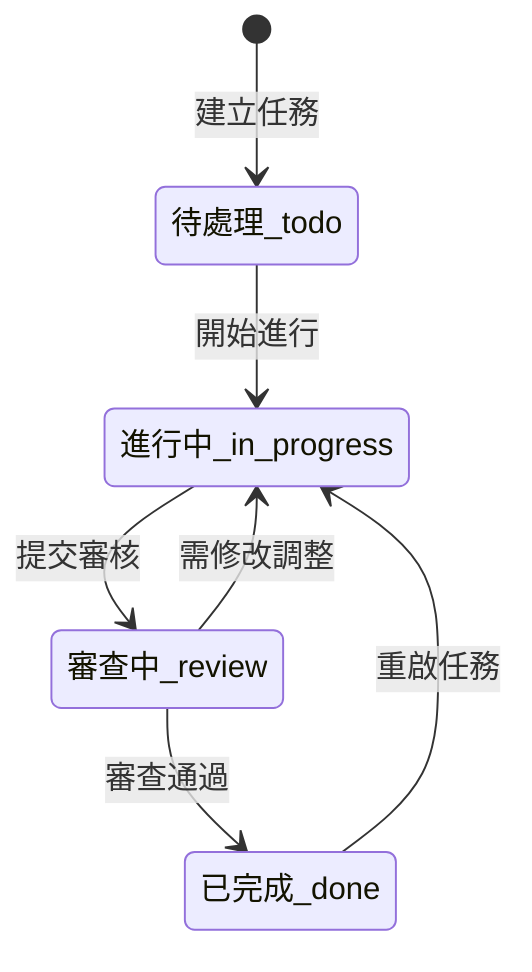

# 05 - 敏捷專案任務看板模組規格 (Project Kanban Module)

## 1. 模組定位與架構

專案看板模組提供團隊進行敏捷任務排程、進度流轉、工作量評估與同仁指派。此模組直接與全系統員工資料庫連動，確保任務責任人與組織架構即時同步。

---

## 2. 四欄式狀態機 (Kanban State Machine)

看板劃分為四個工作流階段：

| 狀態 Key | 欄位顯示名稱 | 說明 |
| :--- | :--- | :--- |
| `todo` | **待處理 (To Do)** | 待排定或準備執行的工作項目 |
| `in_progress` | **進行中 (In Progress)** | 目前正在積極開發/執行中的任務 |
| `review` | **審查中 (Review)** | 已產出成果，等待 Code Review、測試或主管核可 |
| `done` | **已完成 (Done)** | 已驗收完成並結案之任務 |

---

## 3. 任務卡片解構與優先級定義

### 3.1 優先級別標籤 (Priority Badges)
| 優先級 (`priority`) | 顯示文字 | 視覺主題 | 適用情境 |
| :--- | :--- | :--- | :--- |
| `urgent` | **緊急** | 玫瑰紅膠囊 (`bg-rose-50 text-rose-700 border-rose-200`) | 阻斷性 Bug、緊急上線項目 |
| `high` | **高** | 暖橘色膠囊 (`bg-orange-50 text-orange-700 border-orange-200`) | 本週期核心里程碑任務 |
| `medium` | **中** | 暖黃色膠囊 (`bg-amber-50 text-amber-700 border-amber-200`) | 標準功能開發 |
| `low` | **低** | 鼠尾草綠膠囊 (`bg-[#6B705C]/10 text-[#6B705C] border-[#6B705C]/30`) | 優化、文件撰寫、次要待辦 |

### 3.2 到期日與逾期警示規則 (Due Date & Overdue Indicator)
- 當任務具有 `dueDate`：
  - 若 `dueDate < todayStr` 且狀態 **不為** `done`：卡片到期日標籤自動套用 **紅色粗體警示**，並附加「已逾期」徽章。
  - 若已完成 (`done`)：到期日維持一般色階，不顯示逾期警示。

---

## 4. 篩選與搜尋規格 (Filtering Engine)

看板頂部提供即時前端聯動篩選器：
1. **關鍵字搜尋**：即時比對任務標題 (`title`) 與詳細內容 (`description`)。
2. **指派成員過濾**：下拉選單選取特定員工（或「全部成員」）。
3. **優先級過濾**：選取緊急 / 高 / 中 / 低。
4. **自訂標籤過濾**：點擊特定 Tag 即時縮小範圍。
