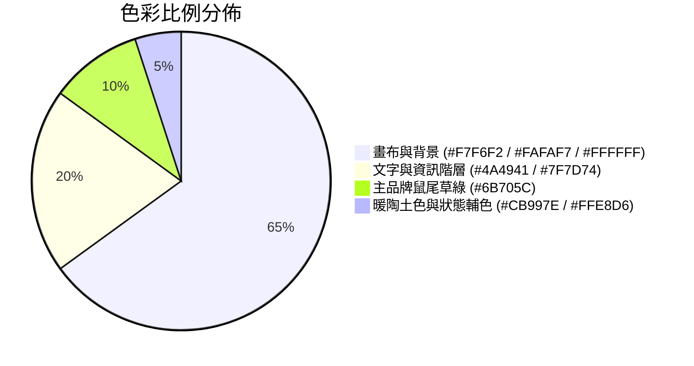

# 06 - 視覺設計系統與 UI/UX 規範 (Design System & UI/UX)

## 1. 設計哲學與美學基調

系統採用 **莫蘭迪大地自然極簡風格 (Morandi Earth-Tone Warm Minimalism)**：
- **視覺抗疲勞**：以柔和暖米白與鼠尾草綠替代刺眼冷灰，營造安靜、舒適的企業辦公軟體體驗。
- **高清晰度資訊架構**：細緻線框 (`#E5E0D8`) 搭配適度圓角 (`rounded-2xl`) 與層級陰影。

---

## 2. 色票系統 (Color Tokens)

| Token 名稱 | Hex 代碼 | 說明 |
| :--- | :--- | :--- |
| `Canvas` | `#F7F6F2` | 全域畫布底色 |
| `Surface` | `#FAFAF7` | 卡片次級底色 |
| `Card` | `#FFFFFF` | 主卡片底色 |
| `Border` | `#E5E0D8` | 標準邊框與分割線 |
| `Primary (Sage)` | `#6B705C` | 主品牌色、簽到按鈕、正常出勤 |
| `Dark (Text)` | `#4A4941` | 主要文字 |
| `Accent` | `#CB997E` | 簽退按鈕、請假標籤 |

---

## 3. 響應式斷點與觸控適配 (Responsive Ergonomics)

1. **行動端優先觸控區**：所有按鈕、打卡觸發器與彈窗確定鈕，最小點擊目標為 $44 \times 44\text{ px}$。
2. **看板行動端橫向滑動**：在手機螢幕下，看板四欄支援流暢的橫向滾動 (`overflow-x-auto snap-x`)。
3. **動態過場動效 (Motion)**：
   - 視圖切換：`y: 8 -> 0`, `opacity: 0 -> 1`，過渡時間 `0.2s`。
   - 彈窗呈現：`scale: 0.95 -> 1.0` 搭配 `backdrop-blur-sm` 毛玻璃模糊遮罩。
